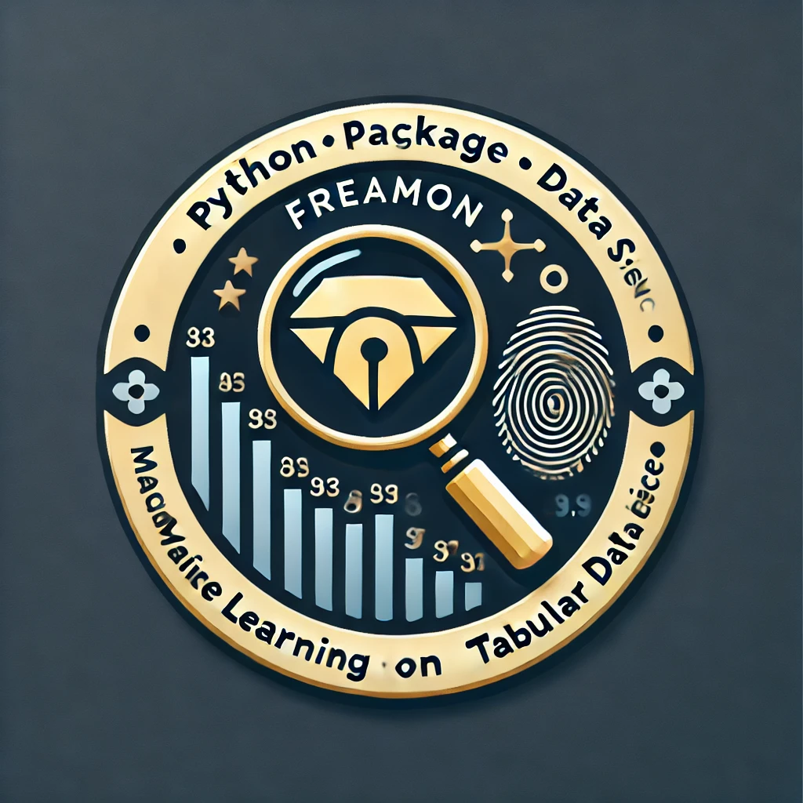

# Freamon: Feature-Rich EDA, Analytics, and Modeling Toolkit

<p align="center">
  
</p>

[](https://pypi.org/project/freamon/)
[](https://github.com/srepho/freamon/releases)

Freamon is a comprehensive Python toolkit for exploratory data analysis, feature engineering, and model development with a focus on practical data science workflows.

## Features

- **Exploratory Data Analysis**: Automatic EDA with comprehensive reporting in HTML, Markdown, and Jupyter notebooks
- **Feature Engineering**: Advanced feature engineering for numeric, categorical, and text data
- **Deduplication**: Multiple deduplication methods with index tracking to map results back to original data
- **Topic Modeling**: Optimized text analysis with NMF and LDA, supporting large datasets up to 100K documents
- **Automated Modeling**: Intelligent end-to-end modeling workflow for text, tabular, and time series data
- **Modeling**: Custom model implementations with feature importance and model interpretation
- **Pipeline**: Scikit-learn compatible pipeline with additional features
- **Drift Analysis**: Tools for detecting and analyzing data drift
- **Word Embeddings**: Integration with various word embedding techniques
- **Visualization**: Publication-quality visualizations with proper handling of all special characters
- **Performance Optimization**: Multiprocessing support and intelligent sampling for large dataset analysis

## Installation

```bash
pip install freamon
```

## Quick Start

```python
from freamon.eda import EDAAnalyzer

# Create an analyzer instance
analyzer = EDAAnalyzer(df, target_column='target')

# Run the analysis
analyzer.run_full_analysis()

# Generate a report
analyzer.generate_report('eda_report.html')

# Or a markdown report for version control
analyzer.generate_report('eda_report.md', format='markdown')
```

## Key Components

### Automated Modeling Flow

Perform end-to-end modeling with automatic handling of text and time series features:

```python
from freamon import auto_model

# Simple interface - just provide a dataframe, target, and optional date column
results = auto_model(
    df=train_df,
    target_column='target',
    date_column='date',  # Optional for time series
    model_type='lightgbm',
    problem_type='classification',
    text_columns=['text_column'],  # Will be auto-detected if not provided
    categorical_columns=['category_column']  # Will be auto-detected if not provided
)

# Access the trained model and results
model = results['model']
feature_importance = results['feature_importance']
text_topics = results['text_topics']
cv_metrics = results['metrics']

# Make predictions on new data
predictions = results['autoflow'].predict(test_df)
```

### EDA Module

The EDA module provides comprehensive data analysis:

```python
from freamon.eda import EDAAnalyzer

analyzer = EDAAnalyzer(df, target_column='target')
analyzer.run_full_analysis()

# Generate different types of reports
analyzer.generate_report('report.html')  # HTML report
analyzer.generate_report('report.md', format='markdown')  # Markdown report
analyzer.generate_report('report.md', format='markdown', convert_to_html=True)  # Both formats
```

### Deduplication with Tracking

Perform deduplication while maintaining the ability to map results back to the original dataset:

```python
from freamon.deduplication.exact_deduplication import hash_deduplication
from examples.deduplication_tracking_example import IndexTracker

# Initialize tracker with original dataframe
tracker = IndexTracker().initialize_from_df(df)

# Perform deduplication
deduped_df = hash_deduplication(df['text_column'])

# Update tracking
kept_indices = deduped_df.index.tolist()
tracker.update_from_kept_indices(kept_indices)

# Map results back to original dataset
full_results = tracker.create_full_result_df(
    results_df, original_df, fill_value={'predicted': None}
)
```

### Pipeline with Deduplication

Create ML pipelines that include deduplication steps:

```python
from freamon.pipeline.pipeline import Pipeline
from examples.pipeline_with_deduplication_tracking import (
    IndexTrackingPipeline, HashDeduplicationStep
)

# Create pipeline with deduplication
pipeline = IndexTrackingPipeline(steps=[
    TextPreprocessingStep(text_column='text'),
    HashDeduplicationStep(text_column='processed_text'),
    ModelTrainingStep()
])

# Run pipeline and track indices
processed_data = pipeline.fit_transform(df)

# Map results back to original indices
mapped_results = pipeline.create_full_result_df(
    'model_training', results_df, fill_value={'predicted': 'unknown'}
)
```

## Documentation

For more detailed information, refer to the examples directory and the following resources:

- [Deduplication Tracking](README_DEDUPLICATION_TRACKING.md)
- [Markdown Report Generation](README_MARKDOWN_REPORTS.md)
- [LSH Deduplication](README_LSH_DEDUPLICATION.md)

## License

[MIT License](LICENSE)